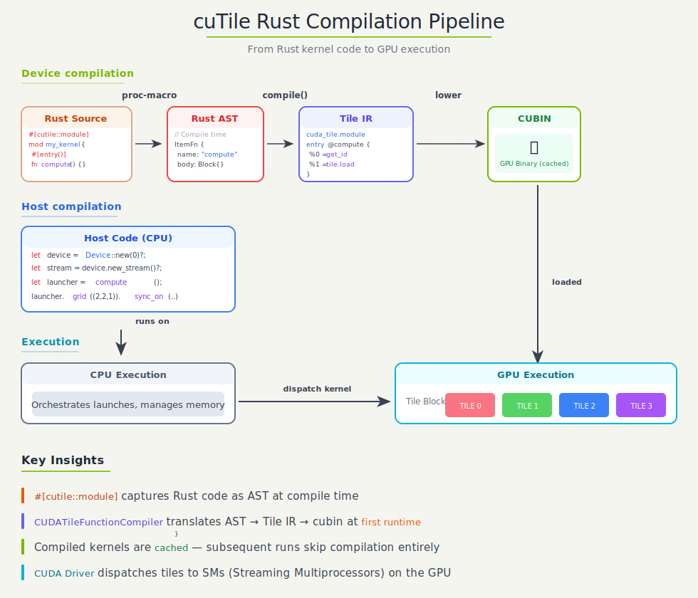

# Introduction

**cuTile Rust** is a safe tile-based parallel programming model for Rust. It automatically leverages advanced hardware capabilities — Tensor Cores, Tensor Memory Accelerators — while providing portability across NVIDIA GPU architectures, without requiring code changes. On the host side, it provides a safe API for allocating device tensors, partitioning mutable tensors for safe parallel access, wrapping shared immutable tensors in `Arc`, constructing kernel launchers, and JIT-compiling and asynchronously executing tile kernels on the GPU.

---

## A First Kernel

cuTile Rust kernels are GPU programs that execute concurrently across a logical grid of tile blocks. The `#[cutile::entry()]` attribute marks a Rust function as an *entry point*: a function you can call from your Rust program that executes on the GPU.

```rust
use cutile::prelude::*;
use my_module::add;

#[cutile::module]
mod my_module {
    use cutile::core::*;

    #[cutile::entry()]
    fn add<const S: [i32; 2]>(
        z: &mut Tensor<f32, S>,
        x: &Tensor<f32, { [-1, -1] }>,
        y: &Tensor<f32, { [-1, -1] }>,
    ) {
        let tile_x = load_tile_like_2d(x, z);
        let tile_y = load_tile_like_2d(y, z);
        z.store(tile_x + tile_y);
    }
}

fn main() -> Result<(), cuda_async::error::DeviceError> {
    let ctx = cuda_core::CudaContext::new(0)?;
    let stream = ctx.new_stream()?;

    let x = api::ones::<f32>(&[32, 32]).sync_on(&stream)?;
    let y = api::ones::<f32>(&[32, 32]).sync_on(&stream)?;
    let mut z = api::zeros::<f32>(&[32, 32]).sync_on(&stream)?;

    let _ = add((&mut z).partition([4, 4]), &x, &y).sync_on(&stream)?;
    Ok(())
}
```

Here, `main` is host Rust code: it runs on the CPU, allocates tensors, and launches work. The `add` function is device Rust code because it is marked with `#[cutile::entry()]`; when `main` first calls `add(...)`, cuTile Rust JIT-compiles that function into optimized GPU code. The `#[cutile::module]` macro makes `my_module` expose the generated host-side APIs for launching `add`.



At first call, the pipeline transforms the entry function through Rust AST → MLIR → cubin. Subsequent calls reuse the cached binary, so JIT overhead is paid once per unique specialization.

---

## Kernel Arguments and Launching

On the host side, the generated launcher accepts several forms for each kernel parameter:

| Kernel param | Host input | What the kernel sees |
|---|---|---|
| `&Tensor<T, S>` | `&Tensor<T>`, `Arc<Tensor<T>>`, or `Tensor<T>` | `&Tensor<T, S>` (read-only) |
| `&mut Tensor<T, S>` | `Partition<&mut Tensor<T>>` or `Partition<Tensor<T>>` | `&mut Tensor<T, S>` (one tile-shaped region) |
| Scalar (`f32`, etc.) | Same scalar | Same scalar |

Partitioning splits a tensor into disjoint regions with a fixed tile shape, such as `partition([4, 4])` for a 2D tensor. Each tile block receives one partition element, which is how cuTile Rust gives the kernel mutable access to one region at a time while keeping writes non-overlapping.

The borrow-based form (`&Tensor`, `Partition<&mut Tensor>`) lets you pass tensors without moving them. The kernel writes through the borrow — no `unpartition()` or return capture needed.

The simplest launch pattern borrows everything:

```rust
let x = api::ones::<f32>(&[32, 32]).sync_on(&stream)?;
let y = api::ones::<f32>(&[32, 32]).sync_on(&stream)?;
let mut z = api::zeros::<f32>(&[32, 32]).sync_on(&stream)?;

// Borrow-based: z is written in place.
let _ = add((&mut z).partition([4, 4]), &x, &y).sync_on(&stream)?;
```

The launcher also accepts lazy `DeviceOp` arguments — everything stays lazy until `.sync()` or `.await`:

```rust
let z = api::zeros(&[32, 32]).partition([4, 4]);
let x = api::ones::<f32>(&[32, 32]);
let y = api::ones::<f32>(&[32, 32]);

let (_z, _x, _y) = add(z, x, y).sync()?;
```

For chaining, use `.then()` to compose operations on the same stream:

```rust
let result = allocate()
    .then(|buf| fill_kernel(buf))
    .then(|buf| process_kernel(buf))
    .sync()?;
```

---

## Tensors and Tiles

Kernels move data between **Tensors** and **Tiles** using operations like `load_tile` and `store`. Both are tensor-like data structures: each has a specific **shape** (the number of elements along each axis) and a **dtype** (the data type of elements). The difference is where they live and what you can do with them.

### Tensors (Global Memory)

**Tensors** are multi-dimensional arrays stored in **global memory (HBM)**. They are:

- **Kernel arguments** — Passed as `&mut Tensor<E, S>` for writable outputs or `&Tensor<E, S>` for read-only inputs
- **Physical storage** — Have strided memory layouts in GPU global memory
- **Limited operations** — Within kernel code, they mainly support loading and storing data as tiles; direct arithmetic is not supported
- **External data** — Candle tensors and other GPU buffers can be passed as tensors from host code to kernels via kernel arguments

```rust
// Tensor parameters in kernel signature
fn kernel(
    output: &mut Tensor<f32, S>,      // Mutable tensor (can store to)
    input: &Tensor<f32, {[-1, -1]}>   // Immutable tensor (read-only)
) { ... }
```

### Tiles

**Tiles** are **immutable** multi-dimensional array fragments that live in GPU **registers** during kernel execution. They are:

- **Immutable** — Operations create new tiles rather than modifying existing ones
- **Compiler-managed storage** — Tile data lives in registers; the compiler handles shared memory staging and other memory hierarchy details automatically
- **Compile-time static shapes** — Tile dimensions must be compile-time constants (often powers of two for optimal performance)
- **Rich operations** — Support elementwise arithmetic, matrix multiplication, reduction, shape manipulation, and more

```rust
// Tiles are created and transformed, never mutated
let tile_a = load_tile_like_2d(a, output);    // Load creates a tile
let tile_b = load_tile_like_2d(b, output);    // Another tile
let result_tile = tile_a + tile_b;            // New tile from operation
output.store(result_tile);                     // Store tile to tensor
```

### The Load → Compute → Store Pattern

Every cuTile Rust kernel follows the same fundamental pattern:


1. **Load**: Move data from global memory (Tensor) into tiles
2. **Compute**: Perform operations on tiles
3. **Store**: Write results from tiles back to global memory (Tensor)

This is key to performance: global memory is slow compared to on-chip resources. By loading once, computing many operations, and storing once, we maximize the compute-to-memory ratio.

---

## Use cases

**Use cuTile Rust when:**
- You need custom GPU kernels not available in libraries
- You want to fuse multiple operations for performance
- You're building performance-critical ML infrastructure
- You need Rust's safety guarantees on GPU code

**Don't use cuTile Rust when:**
- Standard library operations (cuBLAS, cuDNN) suffice
- You need maximum portability across GPU *vendors*
- Your team is deeply invested in the CUDA C++ ecosystem

> **Note**: For algorithms requiring warp-level primitives or custom CUDA C++ kernels, see [Integrating with CUDA C++](interoperability.md); custom kernels can participate in the same `DeviceOp` execution model as your tile kernels.

---

Continue to [Thinking in Tiles](thinking-in-tiles.md), or jump straight to the [Tutorials](../tutorials/01-hello-world.md).
